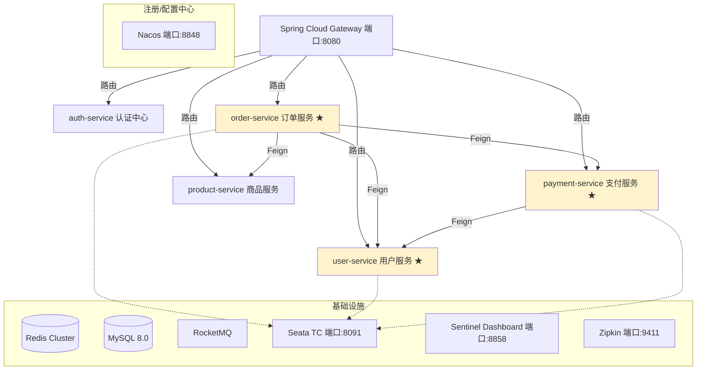

# 微服务全景架构基线

> 项目级全局文档，记录 codexx 微服务体系的总体架构
> 任何变更若涉及新增服务、调整服务边界、变更跨服务调用关系，必须更新本文档

---

## 1. 服务全景图



> ★ = add-points-deduction 变更涉及的服务（2026-05-19）

---

## 2. 服务清单

| 服务名 | 职责 | 端口 | 数据库 | 依赖服务 | 状态 |
|--------|------|------|--------|---------|------|
| `gateway` | 统一入口、路由、鉴权前置 | 8080 | - | Nacos | 稳定 |
| `auth-service` | JWT 签发、Token 校验 | 9001 | `auth_db` | Nacos, Redis | 稳定 |
| `user-service` | 用户信息、积分账户 | 9002 | `user_db` | Nacos, Redis | **变更中** |
| `order-service` | 订单生命周期管理 | 9003 | `order_db` | Nacos, user, payment, product | **变更中** |
| `payment-service` | 支付单、支付回调 | 9004 | `payment_db` | Nacos, user | **变更中** |
| `product-service` | 商品管理、库存 | 9005 | `product_db` | Nacos, Redis | 稳定 |

---

## 3. 跨服务调用矩阵

| 调用方 ↓ / 被调用方 → | order | user | payment | product |
|------------------------|-------|------|---------|---------|
| **order-service** | - | ✓ 用户信息、积分冻结/扣减 | ✓ 创建支付单 | ✓ 查询商品 |
| **payment-service** | - | ✓ 用户信息查询 | - | - |

---

## 4. 数据存储拓扑

```
MySQL 8.0
├── user_db
│   ├── user               # 用户表
│   ├── user_address       # 用户地址
│   ├── points_account     # [NEW] 积分账户
│   └── points_flow        # [NEW] 积分流水
├── order_db
│   ├── order              # 订单表（+points_deduction_amount）[MODIFIED]
│   └── order_item         # 订单明细
├── product_db
│   ├── product            # 商品
│   └── inventory          # 库存
└── payment_db
    ├── payment_order      # 支付单
    └── payment_callback   # 支付回调记录
```

---

## 5. Nacos 配置关键项

| Data ID | Group | 说明 |
|---------|-------|------|
| `common.yaml` | DEFAULT_GROUP | 全局通用配置 |
| `user-service.yaml` | DEFAULT_GROUP | 用户服务配置 |
| `order-service.yaml` | DEFAULT_GROUP | 订单服务配置 |
| `payment-service.yaml` | DEFAULT_GROUP | 支付服务配置 |
| `points.exchange.rate` | DEFAULT_GROUP | [NEW] 积分汇率（100 积分 = 1 元） |

---

## 6. Sentinel 限流规则基线

| 资源 | 阈值 | 说明 |
|------|------|------|
| `POST:/orders` | 200 QPS | 订单创建 |
| `GET:/orders/{orderId}` | 500 QPS | 订单查询 |
| `POST:/points/freeze` | 200 QPS | [NEW] 积分冻结 |
| `POST:/points/deduct` | 200 QPS | [NEW] 积分扣减 |
| `POST:/points/unfreeze` | 200 QPS | [NEW] 积分解冻 |

---

> 维护人：架构组
> 最后更新：2026-05-19