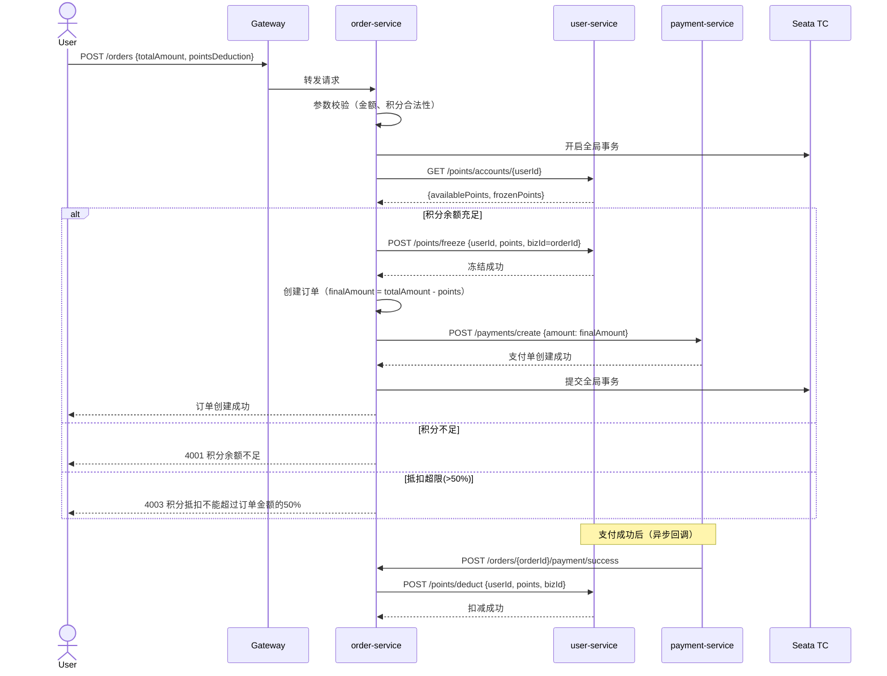
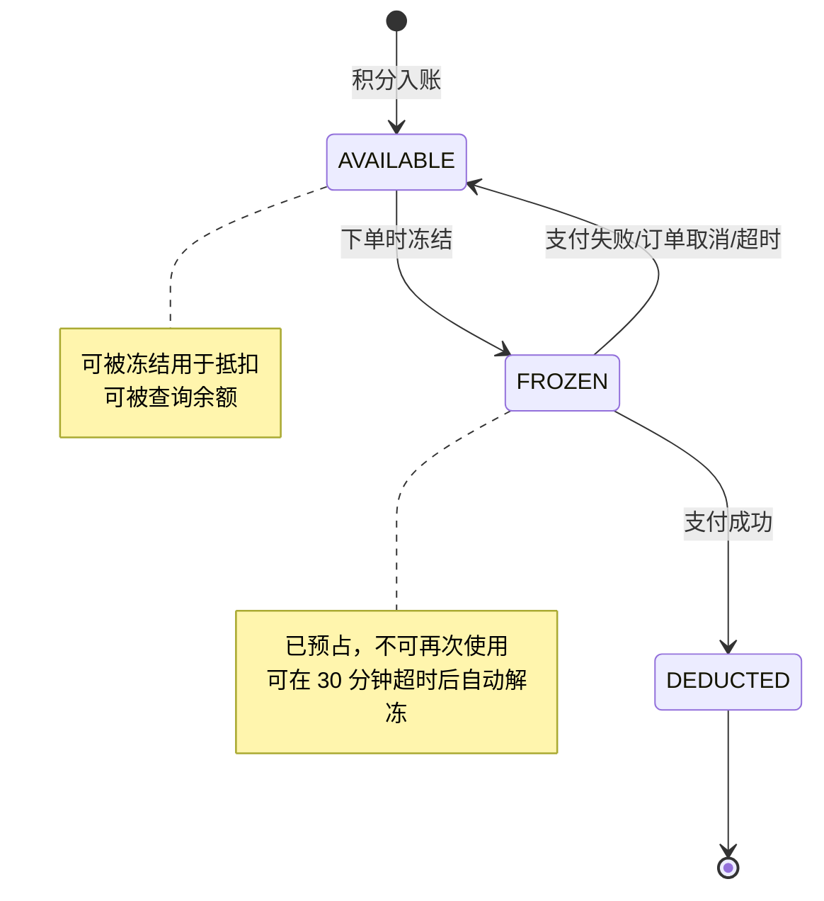

# 架构设计：订单服务积分抵扣功能

> 生成模型：DeepSeek-v4-pro / o3（深度推理模型）
> 对应环节：② 架构与设计
> 基于前置文档：proposal.md, ai-analysis/add-points-deduction.md

---

## 1. 服务交互时序



---

## 2. 积分状态机



**状态变更规则**：
- `AVAILABLE → FROZEN`：校验 `available_points >= request_points`，版本乐观锁
- `FROZEN → DEDUCTED`：仅在支付成功回调时触发，必须验证 `biz_id` 存在且状态为 FROZEN
- `FROZEN → AVAILABLE`：订单超时（30min）或取消时触发，解冻后积分恢复可用

---

## 3. 数据库设计

### 3.1 points_account（用户积分账户）

```sql
CREATE TABLE points_account (
    id              BIGINT PRIMARY KEY AUTO_INCREMENT,
    user_id         BIGINT NOT NULL,
    total_points    BIGINT NOT NULL DEFAULT 0 COMMENT '累计获得积分',
    available_points BIGINT NOT NULL DEFAULT 0 COMMENT '可用积分',
    frozen_points   BIGINT NOT NULL DEFAULT 0 COMMENT '冻结积分',
    used_points     BIGINT NOT NULL DEFAULT 0 COMMENT '已使用积分',
    expired_points  BIGINT NOT NULL DEFAULT 0 COMMENT '已过期积分',
    version         INT NOT NULL DEFAULT 0 COMMENT '乐观锁版本号',
    created_at      DATETIME NOT NULL DEFAULT CURRENT_TIMESTAMP,
    updated_at      DATETIME NOT NULL DEFAULT CURRENT_TIMESTAMP ON UPDATE CURRENT_TIMESTAMP,
    UNIQUE KEY uk_user_id (user_id)
) ENGINE=InnoDB DEFAULT CHARSET=utf8mb4 COMMENT='用户积分账户';
```

### 3.2 points_flow（积分流水）

```sql
CREATE TABLE points_flow (
    id              BIGINT PRIMARY KEY AUTO_INCREMENT,
    user_id         BIGINT NOT NULL,
    biz_id          VARCHAR(64) NOT NULL COMMENT '业务单号（订单号）',
    biz_type        VARCHAR(32) NOT NULL COMMENT '业务类型：ORDER_DEDUCTION',
    operation_type  VARCHAR(32) NOT NULL COMMENT '操作类型：FREEZE/DEDUCT/UNFREEZE',
    points          INT NOT NULL COMMENT '本次操作积分',
    before_points   BIGINT NOT NULL COMMENT '操作前可用积分',
    after_points    BIGINT NOT NULL COMMENT '操作后可用积分',
    status          VARCHAR(16) NOT NULL COMMENT '积分状态：FROZEN/DEDUCTED/UNFROZEN',
    remark          VARCHAR(255) DEFAULT NULL,
    created_at      DATETIME NOT NULL DEFAULT CURRENT_TIMESTAMP,
    UNIQUE KEY uk_biz_operation (biz_id, biz_type, operation_type),
    KEY idx_user_id_created (user_id, created_at)
) ENGINE=InnoDB DEFAULT CHARSET=utf8mb4 COMMENT='积分流水';
```

**幂等性保证**：`uk_biz_operation` 唯一索引确保同一业务单号的同一操作（如冻结）不会被重复执行。

### 3.3 order 表变更

```sql
ALTER TABLE `order` ADD COLUMN `points_deduction_amount` DECIMAL(10,2) NOT NULL DEFAULT 0.00
    COMMENT '积分抵扣金额' AFTER `total_amount`;
```

**兼容性**：默认值 0 保证历史订单不受影响。

---

## 4. 非功能设计

### 4.1 幂等性

```
┌───────────────────────────────────────────────────────┐
│  幂等性分层防护                                       │
├───────────────────────────────────────────────────────┤
│  第一层：业务单号幂等                                  │
│    uk_biz_operation(biz_id, biz_type, operation_type)  │
│    ↓ 重复请求 → DuplicateKeyException → 查询已有结果   │
│                                                       │
│  第二层：Redis 分布式锁（防并发）                       │
│    lock:points:{userId} → 同一用户串行操作积分         │
│    ↓ 锁冲突 → 等待 100ms 重试，最多 3 次               │
│                                                       │
│  第三层：数据库乐观锁（防丢失更新）                      │
│    UPDATE ... SET points = ?, version = version+1      │
│    WHERE user_id = ? AND version = ?                   │
│    ↓ version 冲突 → 重试或返回失败                     │
└───────────────────────────────────────────────────────┘
```

### 4.2 限流熔断（Sentinel）

```java
// 积分冻结接口限流
FlowRule freezeRule = new FlowRule();
freezeRule.setResource("POST:/points/freeze");
freezeRule.setGrade(RuleConstant.FLOW_GRADE_QPS);
freezeRule.setCount(200);  // 每秒最多 200 次

// 熔断规则：错误率 > 50% 时熔断 10 秒
DegradeRule degradeRule = new DegradeRule();
degradeRule.setResource("POST:/points/freeze");
degradeRule.setGrade(RuleConstant.DEGRADE_GRADE_EXCEPTION_RATIO);
degradeRule.setCount(0.5);
degradeRule.setTimeWindow(10);
```

**降级策略**：积分服务熔断时，订单创建接口降级为"积分不可用，请稍后重试或使用全额支付"。

### 4.3 分布式事务（Seata AT）

```java
@Service
@RequiredArgsConstructor
public class OrderServiceImpl implements IOrderService {

    private final PointsFeignClient pointsFeignClient;
    private final PaymentFeignClient paymentFeignClient;
    private final OrderMapper orderMapper;

    @GlobalTransactional(rollbackFor = Exception.class, timeoutMills = 30000)
    public Result<OrderVO> createOrder(CreateOrderDTO dto) {
        // 1. 参数校验
        validatePointsDeduction(dto.getPointsDeduction());

        // 2. 冻结积分（跨服务调用，Seata 自动纳入事务）
        pointsFeignClient.freeze(new FreezePointsDTO(
            dto.getUserId(), dto.getPointsDeduction().getPoints(), orderId
        ));

        // 3. 创建订单（本地事务）
        Order order = buildOrder(dto);
        orderMapper.insert(order);

        // 4. 创建支付单（跨服务调用）
        paymentFeignClient.create(new CreatePaymentDTO(
            orderId, order.getFinalAmount()
        ));

        return Result.success(OrderConvertor.INSTANCE.toVO(order));
    }
}
```

### 4.4 缓存策略

| 缓存 Key | 类型 | TTL | 说明 |
|---------|------|-----|------|
| `points:account:{userId}` | Redis String | 5 min | 积分余额缓存，Caffeine 本地 1 min |
| `points:lock:{userId}` | Redis Lock（Redisson） | 10s（自动续期） | 积分操作分布式锁 |
| `points:rate` | Redis String + Caffeine | 1 hour | 积分汇率，从 Nacos 同步 |

**缓存更新策略**：积分操作后通过 MQ 发送 `PointsChangedEvent`，消费者异步更新缓存。

---

## 5. 错误码定义

| 错误码 | HTTP 状态码 | 说明 |
|--------|-----------|------|
| 200 | 200 | 成功 |
| 4001 | 400 | 积分余额不足 |
| 4002 | 400 | 积分抵扣金额不能超过订单金额 |
| 4003 | 400 | 积分抵扣不能超过订单金额的 50% |
| 5001 | 500 | 积分服务异常 |
| 5002 | 500 | 积分冻结失败 |
| 5003 | 500 | 积分扣减失败 |
| 5030 | 503 | 积分服务熔断降级 |

---

## 6. 风险清单

| 风险 | 可能性 | 影响 | 应对 |
|------|--------|------|------|
| Seata AT 事务超时导致数据不一致 | 中 | 高 | timeout 30s + 异常监控告警 + 对账任务 |
| 高并发积分扣减导致超卖 | 中 | 严重 | Redis 锁 + 乐观锁双重防护 |
| 幂等唯一索引冲突误判 | 低 | 中 | 捕获 DuplicateKeyException 查询已有结果返回 |
| 积分汇率热更新延迟 | 低 | 低 | Caffeine + Redis 二级缓存，偏差 < 1min |